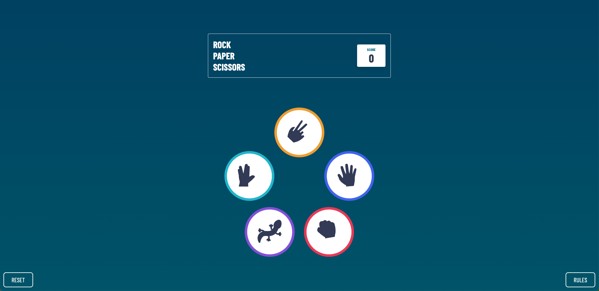
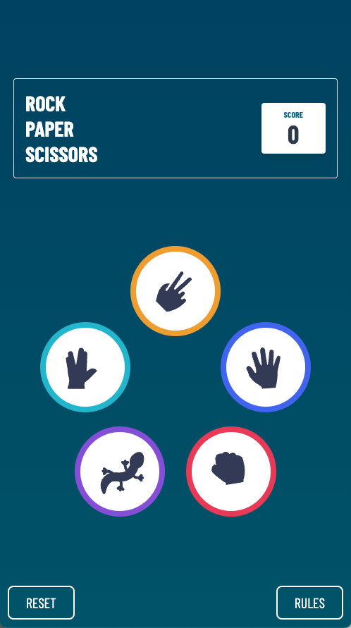
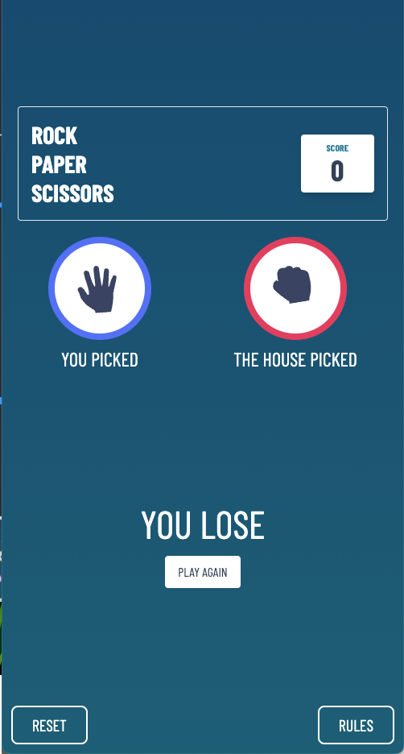

# Frontend Mentor - Rock, Paper, Scissors solution

This is a solution to the [Rock, Paper, Scissors challenge on Frontend Mentor](https://www.frontendmentor.io/challenges/rock-paper-scissors-game-pTgwgvgH). Frontend Mentor challenges help you improve your coding skills by building realistic projects.

## Table of contents

- [Overview](#overview)
  - [The challenge](#the-challenge)
  - [Screenshot](#screenshot)
  - [Links](#links)
- [My process](#my-process)
  - [Built with](#built-with)
  - [What I learned](#what-i-learned)

**Note: Delete this note and update the table of contents based on what sections you keep.**

## Overview

### The challenge

Users should be able to:

- View the optimal layout for the game depending on their device's screen size [x]
- Play Rock, Paper, Scissors, against the computer
- **Bonus**: Play Rock, Paper, Scissors, Lizard, Spock against the computer \_(optional) [ x ]

### Screenshot

### Links

- Live Site URL: [RockPaperScissors](https://rock-paper-scissors-coral-sigma.vercel.app/)

## My process

### Built with

- Create-React-App with TS
- Tailwind
- CSS Grid
- [React](https://reactjs.org/) - JS library
- [Tailwind](https://tailwindcss.com/) - For styles
- [Zustand](https://docs.pmnd.rs/zustand/getting-started/introduction) - for state management

### Continued development

- I want to improve the mobile first mindset
- Focus more on progress instead of small and not important details
